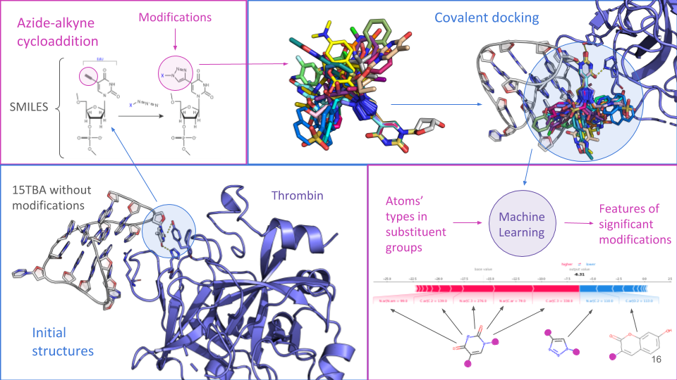

# Aptamers

The use of synthetic oligonucleotides as drugs is a new medical technique that has emerged with the development of nucleic acid chemistry. Aptamers are short synthetic molecules with a complex spatial structure that determines their ability to selectively bind various targets. Aptamers from nucleic acids are functional analogs of monoclonal antibodies but have several advantages: fast and cheap synthesis, high stability, and multiple renaturation cycles.

Despite numerous studies of aptamers over several decades, their implementation in clinical practice is hampered by multiple factors, the most important of which is the low diversity of the nucleic acids alphabet compared to amino acids one. The low diversity of nucleic acids can be corrected by introducing modifications to the nucleotides, but this strategy is rarely associated with success since such modifications can interfere with the aptamer-target complex. However, successful examples are known, and they are often associated with the 15-mer thrombin binding aptamer (15TBA). Modifications of 15TBA improved its affinity to thrombin.

This study is aimed at the development of an *in silico* method for the creation of modified aptamers with improved physicochemical properties. This method allowed us to determine which chemical groups are most important the 15TBA-thrombin interaction, and to predict compounds that increased the affinity of this binding. These results demonstrate that the combination of chemoinformatics, covalent docking, and machine learning tools is an effective method for identifying significant modifications for modulation of the nucleic acid aptamers properties.

